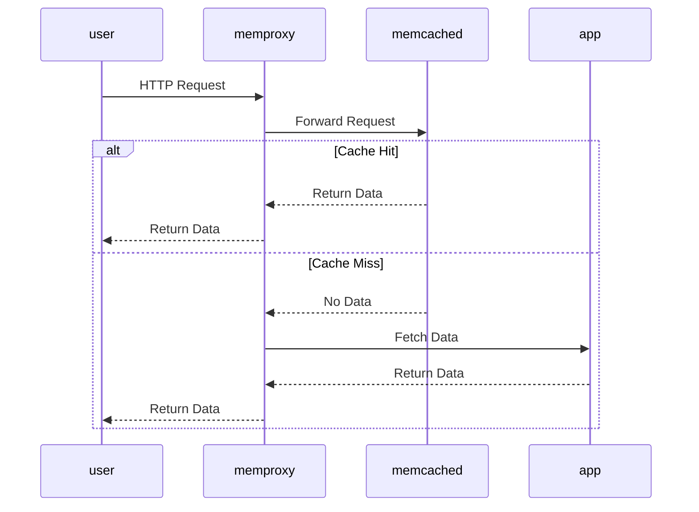

Memproxy
---
Simple http proxy for memcached

### How it works



### Run
For local tests you must create docker network and attach both web-server, cache and memproxy to it.
1. Create docker network:
```
docker network create my-network
```
2. Start any web-server with any given name
```
docker run --rm --network my-network --name web-server -p 8081:80 -v .\index.html:/usr/share/nginx/html/www/index.html:ro -v .\nginx.conf:/etc/nginx/nginx.conf:ro nginx:1.14.2
```
3. Start memproxy
```
docker run --rm --network my-network -p 8080:8080 --name memproxy memproxy:0.1.1 --backend=inmemory --origin='http://web-server:80' --readiness-probe-addr='http://web-server:80' 
```

### Build
Build
```
docker build -t memproxy:0.1.0 .
```

Push
```
docker tag memproxy:0.1.0 zorkinaa/memproxy:0.1.0
docker push zorkinaa/memproxy:0.1.0
```

