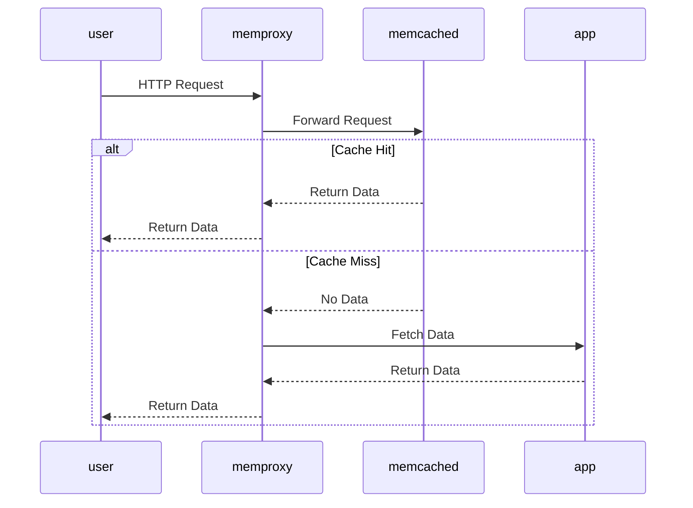

Each node run a copy of memproxy which ensures the lack of external network knote.

```mermaid
sequenceDiagram
    participant user
    participant memproxy
    participant memcached
    participant app
    
    user->>memproxy: HTTP Request
    memproxy->>memcached: Forward Request
    alt Cache Hit
        memcached-->>memproxy: Return Data
        memproxy-->>user: Return Data
    else Cache Miss
        memcached-->>memproxy: No Data
        memproxy->>app: Fetch Data
        app-->>memproxy: Return Data
        memproxy-->>user: Return Data
    end
```
